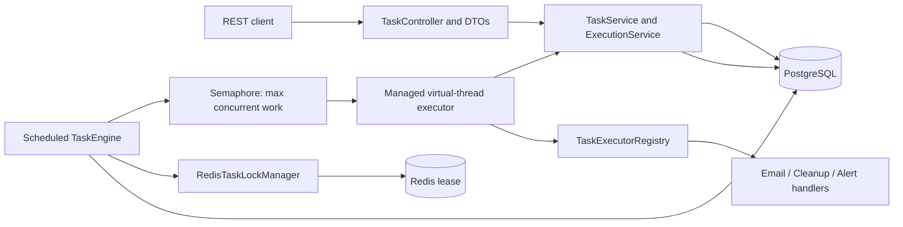

# Distributed Task Scheduling & Alerting Engine

A Java 21 and Spring Boot service for scheduling, executing, tracking, and retrying background work. PostgreSQL stores task state and attempt history. Redis provides short-lived task-specific distributed locks, and a managed Java virtual-thread executor runs the simulated task handlers.

## Problem and features

Background work must run at the right time, survive application restarts, avoid two workers claiming one task, and expose useful failure history. This project demonstrates those mechanics in a single service without requiring real email or alert integrations.

- Schedule `EMAIL`, `CLEANUP`, and `ALERT` tasks through a validated REST API.
- Persist state and execution history in PostgreSQL.
- Atomically claim due rows with a conditional database update.
- Add Redis `SET NX` leases with unique owner tokens and compare-and-delete release.
- Execute bounded concurrent work using Java 21 virtual threads.
- Retry failed attempts with bounded exponential backoff or an explicit manual retry.
- Cancel tasks only while pending; cancelled tasks remain queryable.
- Expose Actuator health and build/test through GitHub Actions.

## Architecture



The database claim is the ownership decision; Redis is an additional distributed coordination guard. Transactions that update state are short and do not span handler execution.

## Structure

```text
src/main/java/com/portfolio/scheduler/
  config/       managed virtual-thread executor
  controller/   REST endpoints
  dto/          request and response records
  entity/       task and attempt persistence models
  enums/        task types and statuses
  exception/    API errors and domain exceptions
  executor/     task handlers and registry
  lock/         Redis lock interface and implementation
  repository/   Spring Data repositories and atomic claim
  scheduler/    polling and bounded dispatch engine
  service/      task lifecycle, retry and execution records
src/test/java/  domain, executor registry, and retry policy tests
```

## Requirements and setup

- JDK 21 (required to run the service and use Java 21 virtual threads)
- Docker Desktop with Docker Compose
- Network access on the first Maven Wrapper run to download Maven and dependencies

This checkout was built in an environment with JDK 26 but without JDK 21. The compiler release is set to 21. For a faithful local run, install JDK 21 and set `JAVA_HOME` to it. `.mvn/maven.config` selects the project-local Maven cache through `maven-settings.xml`; `.m2/` is ignored by Git.

Start dependencies from this project directory:

```powershell
docker compose up -d
```

The same command works in Bash or another terminal with Docker Compose v2. PostgreSQL is available at `localhost:5432` and Redis at `localhost:6379`. Compose provides database and Redis only; the Spring application runs locally.

Run tests and package:

```powershell
.\mvnw.cmd clean test
.\mvnw.cmd package
```

```bash
./mvnw clean test
./mvnw package
```

Run the application:

```powershell
.\mvnw.cmd spring-boot:run
```

```bash
./mvnw spring-boot:run
```

## Dashboard

Once the application is running, open [http://localhost:8080/](http://localhost:8080/) for the built-in task dashboard. It is served by Spring Boot, so there is no separate frontend server to start. The dashboard shows task counts and recent tasks, lets you schedule work, filter by status, inspect attempt history, and cancel pending or retry failed tasks. It refreshes the task list every five seconds; use the refresh button for an immediate update.

The schema is created/updated by Hibernate (`spring.jpa.hibernate.ddl-auto=update`). Local Compose credentials (`postgres` / `password`) are for development only. Override with `DB_URL`, `DB_USERNAME`, `DB_PASSWORD`, `REDIS_HOST`, `REDIS_PORT`, or `SERVER_PORT`. No `.env` containing secrets is required.

The application sets its JVM default timezone to UTC. The API uses UTC instants serialized with a `Z` suffix. For example, `2026-10-10T10:00:00Z` is an absolute UTC time. The body in the original project brief omitted a timezone; this API requires one so the scheduled instant is unambiguous.

## API

Base path: `/api/v1/tasks`

| Method | Path | Result |
|---|---|---|
| POST | `/schedule` | `202 Accepted`, created task |
| GET | `/{id}` | Task or `404` |
| GET | `?status=PENDING&page=0&size=20` | Page; size must be 1–100 |
| DELETE | `/{id}` | `204` when pending task is cancelled, otherwise `409` |
| POST | `/{id}/retry` | Resets a failed task for a new retry cycle, otherwise `409` |
| GET | `/{id}/history` | Attempt records in attempt order |

Schedule a task:

```http
POST /api/v1/tasks/schedule
Content-Type: application/json
```

```json
{
  "taskType": "EMAIL",
  "executionTime": "2026-10-10T10:00:00Z",
  "maxRetries": 3
}
```

Example response (`202`):

```json
{
  "id": 1,
  "taskType": "EMAIL",
  "executionTime": "2026-10-10T10:00:00Z",
  "status": "PENDING",
  "retryCount": 0,
  "maxRetries": 3,
  "lastError": null,
  "createdAt": "2026-10-09T16:30:00Z",
  "updatedAt": "2026-10-09T16:30:00Z"
}
```

`maxRetries` must be between 0 and 20. `retryCount` counts retries already scheduled; it does not include the initial attempt. With `maxRetries=3`, up to four attempts can be run. Automatic retry delay doubles from one second and caps at one minute by default. A manual retry is allowed only for `FAILED` tasks and begins a new cycle without erasing prior history.

## Locking, failure behavior, and limits

The poller first acquires `scheduler:task:{id}` in Redis with a random owner token and a finite lease (30 seconds by default), then conditionally changes the still-due row from `PENDING` to `RUNNING`. Only one competing database update can claim the row. Lock release runs a Lua compare-and-delete, so an old owner cannot delete a newer owner's lock. Redis connection failures are logged and prevent dispatch for that poll.

The lease should exceed normal handler duration. A lease expiration does not stop a slow or paused worker; if execution can exceed the lease, workers could overlap after lease expiry. The database claim still prevents a second claim while the row remains `RUNNING`, but recovery of abandoned `RUNNING` rows is not currently implemented. The semaphore bounds submitted work to 32 by default. Handler implementations currently log simulated work; replace them with idempotent integrations before using real side effects.

This service does not guarantee exactly-once external effects. A process can perform an external action and crash before persisting success. Idempotency keys, an outbox, or application-specific reconciliation may be needed for reliable integrations. There is no authentication; treat the service as a local development application.

Hibernate schema update is convenient for this portfolio demo, not a production migration strategy. A production deployment should add reviewed schema migrations, authentication/authorization, stale-running recovery, and operational metrics/alerts.

## Health and logs

Open `http://localhost:8080/actuator/health` for aggregate health status. `/actuator/health/liveness` and `/actuator/health/readiness` expose application liveness/readiness probes; the aggregate includes PostgreSQL and Redis dependency health. Simulated handler outcomes and scheduler failures are logged through SLF4J with task IDs. Attempt details are available at `GET /api/v1/tasks/{id}/history`.

## Implemented and future work

Implemented: REST lifecycle operations, validation, persistence models, due-task lookup, conditional database claiming, Redis lease management, virtual-thread dispatch with a concurrency bound, retry policy, attempt history, local Compose dependencies, and Maven CI.

Future work: integration-level PostgreSQL/Redis tests, stale `RUNNING` recovery, database migrations, idempotency/outbox support, authentication, real task integrations, and richer metrics. The default test suite does not require Docker.

## Resume bullet suggestions

- Built a Spring Boot REST API for scheduling, cancelling, retrying, and inspecting background tasks.
- Persisted task state and execution history in PostgreSQL with atomic conditional task claiming.
- Added Redis owner-token leases with finite expiration and Lua compare-and-delete release.
- Implemented bounded task retries and Java virtual-thread execution with a concurrency limit.
- Added unit tests with JUnit 5 and Mockito, plus Maven Wrapper and GitHub Actions CI.

Adapt these bullets to match the parts you have personally verified and can explain.

## Interview topics

1. **Why combine a database claim and Redis lock?** The conditional database update is the durable single-winner claim. Redis adds short-lived coordination and owner-safe release across instances.
2. **Why not claim exactly once?** A crash can occur after an external side effect but before success is committed. Distributed transactions are not assumed.
3. **What does `maxRetries` count?** It is the number of retries after the initial attempt; total attempt ceiling is `maxRetries + 1`.
4. **What happens if work exceeds its Redis lease?** The lease can expire while the worker remains active. The lease must match expected execution durations; long tasks need renewal or stronger idempotency and recovery design.
5. **Why virtual threads with a semaphore?** Virtual threads reduce the cost of blocking work; the semaphore limits in-flight tasks and applies basic backpressure.
